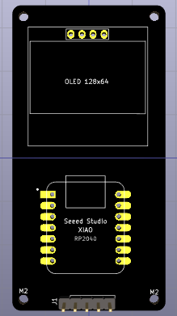
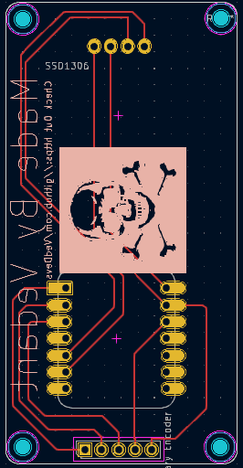
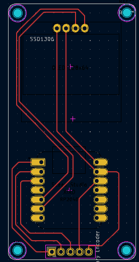
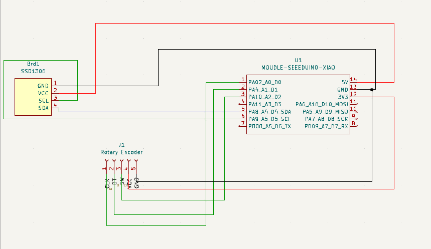

# PocketVault

A Password manager that fits in your pocket powered by the Seeed Studio XIAO RP2040.

---

## Features

- Offline password storage
- USB HID password typing
- OLED interface (Both 128x64 and 128x32 OLED's supported)
- Rotary encoder navigation
- No internet connection required
- Pocket-sized form factor

---

## Hardware

### Components

- Seeed Studio XIAO RP2040
- OLED Display (128×32 or 128×64)
- Rotary Encoder
- Custom PocketVault PCB
- 3D Printed Enclosure

---

## Firmware Features

### Current

- Project structure
- Menu system architecture
- Password vault structure
- Configurable display support

### Planned (Comming as soon as I get the Hardware!!)

- OLED UI
- Encoder input handling
- USB HID keyboard support
- Flash storage
- Master PIN lock screen
- Settings menu
- Password management

---
## PCB

This was my first PCB so please look carefully for problems (If you find some please email me).






---
## 3D enclosure 
It is in progress as I'm new to this skill


## Making it your Self

### Requirements

* Visual Studio Code
* PlatformIO Extension
* PCB (or make it your self using a perfboard)
* 3D printed Enclosure (or make it using sunboard)

### Clone

```bash
git clone https://github.com/VedDevs/PocketVault.git
cd PocketVault
```

### Build

```bash
pio run
```

### Upload

```bash
pio run -t upload
```

---

## Controls

| Action         | Function      |
| -------------- | ------------- |
| Rotate Encoder | Navigate Menu |
| Short Press    | Select / Back |
| Long Press     | Type Password |

---

## 0.91" OLED display Variant on Perfboard


---

## Contributing

Contributions & suggestions are welcome.

---
Made with ❤️ by Ved for StarDance
